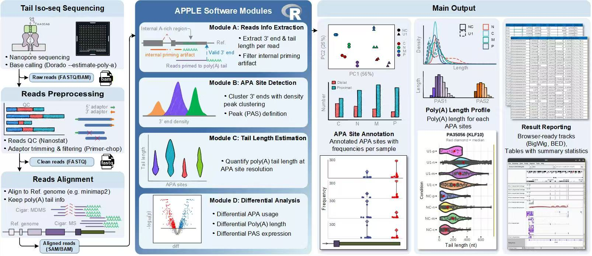
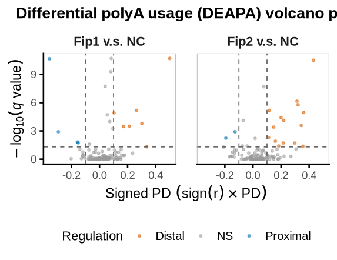
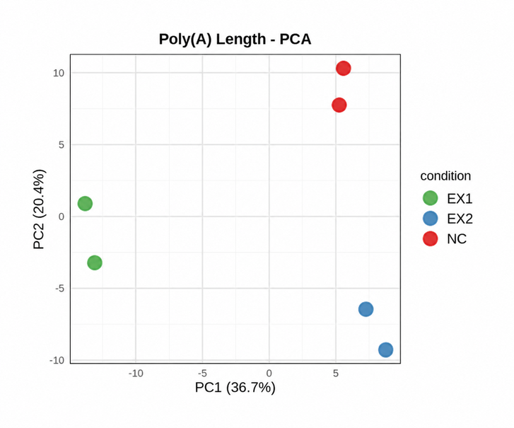
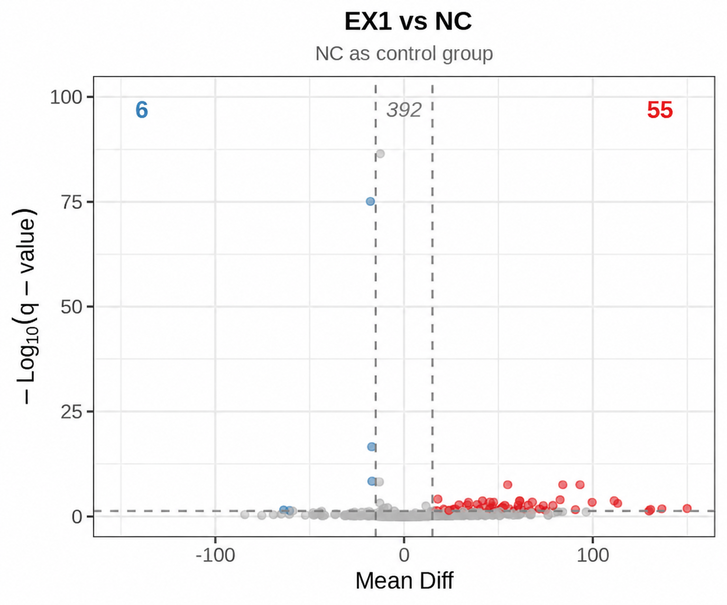
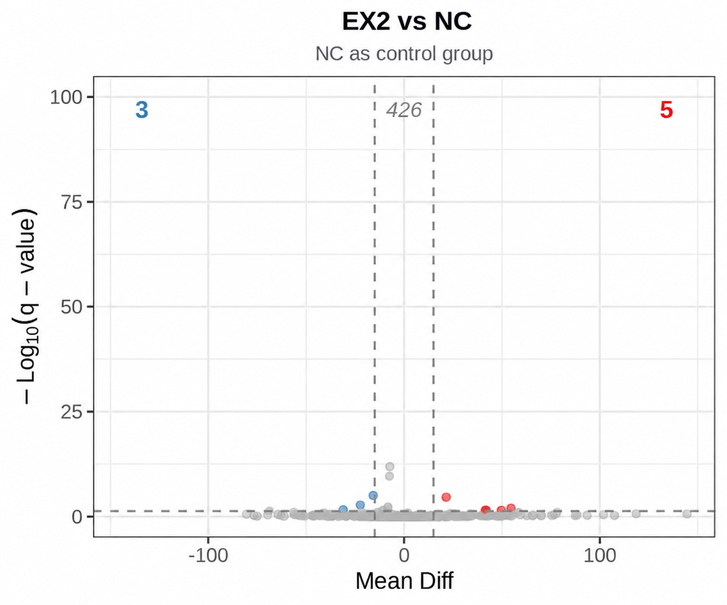

<h1></h1>


*Analysis of poly(A) tail lengths and alternative polyadenylation in R.*

**Author:** Zi Wang  

APPLE connects read processing, poly(A) site clustering, genomic annotation, tail-length comparisons, and gene-level APA analysis in one workflow.

| Analysis | Main outputs |
| --- | --- |
| Poly(A) sites | Annotated poly(A) site clusters (PACs) and sample counts |
| Poly(A) tails | PAC-level tail-length summaries, statistical comparisons, and PCA |
| APA dynamics | Changes in PAC usage, relative poly(A) position, and directional shifts |

**Contents**

- [1. Introduction](#1-introduction)
- [2. Installation](#2-installation)
- [3. Workflow](#3-workflow)
  - [3.1 Read alignment](#31-read-alignment)
  - [3.2 Site and tail extraction](#32-site-and-tail-extraction)
  - [3.3 PAC identification and annotation](#33-pac-identification-and-annotation)
  - [3.4 Tail-length analysis](#34-tail-length-analysis)
  - [3.5 Differential PAC counts](#35-differential-pac-counts)
  - [3.6 Differential APA analysis](#36-differential-apa-analysis)
- [4. Worked example](#4-worked-example)
  - [4.1 Example figures](#41-example-figures)

## 1. Introduction

APPLE analyzes poly(A) site usage and tail-length measurements from sequencing data. It groups nearby sites into poly(A) site clusters (PACs), annotates their genomic context, and builds sample-level PAC count data. Downstream functions compare individual mRNA tail lengths, analyze PAC abundance, and summarize shifts in within-gene PAC usage.

### Why APPLE?

**APPLE** stands for **A**lternative **P**olyadenylation [APA] and **P**oly(A) **L**ength **E**stimation. The name captures the two central dimensions of the software: where transcripts are polyadenylated and how long their poly(A) tails are.

These analyses address different questions: changes in tail length, changes in site abundance, and redistribution among sites within the same gene. Input reads and tail-length annotations must be prepared for the extraction workflow described below.

## 2. Installation

> **Platform compatibility:** APPLE is recommended for Linux or macOS. Some command-line tools and multicore functions may not be fully compatible with Windows, so parts of the workflow may fail or require manual adjustment on Windows.

The complete workflow invokes command-line tools and uses multicore processing. Install external tools separately and make sure they are available on your PATH.

### Install dependencies and APPLE

Install samtools, bedtools, and minimap2 separately for the full alignment and extraction workflow. The package declares its R dependencies in DESCRIPTION. These include DESeq2 for differential PAC abundance, DEXSeq for differential APA usage, and BiocParallel for multicore analysis. Bioconductor repositories are needed so that these dependencies are installed automatically with APPLE.

```
if (!requireNamespace("BiocManager", quietly = TRUE)) {
  install.packages("BiocManager")
}
if (!requireNamespace("remotes", quietly = TRUE)) {
  install.packages("remotes")
}
options(repos = BiocManager::repositories())
remotes::install_github(
  "wangziiiiiii/APPLE.R",
  dependencies = NA,
  upgrade = "never"
)
library(APPLE)
```

While the repository is private, installation requires GitHub authentication with access to the APPLE repository. Loading APPLE does not install packages or attach dependency packages to the search path.

**API migration:** the latest source uses Map.Tail(), Tail.PCA(), and Tail.DiffPair(). These replace mapTail(), tail_pca(), and polyAlength(), respectively. Tail.DiffPair() accepts one treatment and one method per call; Tail.PCA() has new arguments and returns a list. Update existing scripts rather than substituting function names alone.

## 3. Workflow

Follow steps 3.1–3.3 to prepare annotated PACs, then use tail-length analysis, differential PAC count analysis, or gene-level APA analysis as appropriate for your question.

[](docs/images/apple-workflow.jpg)

*Overview of the APPLE workflow. Click the image to view it at full size.*

### 3.1 Read alignment

The minimap2() wrapper aligns FASTQ files to a reference genome, filters SAM records, and sorts the output. Skip this step if suitable SAM alignments are already available.
Remove primers before alignment. The wrapper accepts .fq, .fastq, and their gzip-compressed equivalents.

#### Usage

Process FASTQ files in a specified directory:

```
sam_files <- minimap2(reference = "/path/to/genome.fa",
                      work_dir = "/path/to/fastq/",
                      threads = 8,
                      filter_flags = 2308)
```

#### Arguments

| Parameter | Description |
| --- | --- |
| `reference` | Reference genome file path |
| `work_dir` | Working directory path containing fq files |
| `threads` | Number of threads for minimap2, default is 4 |
| `filter_flags` | SAM flags to filter out, default is 2308 |

### 3.2 Site and tail extraction

Extract_polyAsite() scans SAM alignments and writes BED-like poly(A) site files with tail-length information. It samples records to detect pt:i: tags and uses those values when available; otherwise, it attempts sequence-based tail detection with regular expressions. Tag-based and sequence-based estimates depend on the upstream data preparation and should not be assumed interchangeable.

Use an absolute work_dir path: this function changes the R working directory. Set remove_temp_files = TRUE when loading all resulting .bed files from the directory, so intermediate files are excluded.

#### Usage

Extract poly(A) sites and tail lengths from SAM files:

```
results <- Extract_polyAsite(work_dir = "/path/to/sam/",
                             intron_max = 50000,
                             min_tail_length = 6,
                             bedtools_path = "bedtools",
                             remove_temp_files = FALSE)
```

#### Arguments

| Parameter | Description |
| --- | --- |
| `work_dir` | Working directory containing SAM files |
| `intron_max` | Maximum intron size, default is 50000 |
| `min_tail_length` | Minimum polyA tail length to consider, default is 6 |
| `sample_size` | Number of lines to sample for pt tag detection, default is 1000 |
| `bedtools_path` | Path to bedtools executable, default is "bedtools" |
| `remove_temp_files` | Whether to remove temporary files, default is FALSE |

### 3.3 PAC identification and annotation

Load site data, define PACs, assign genomic features, filter low-count clusters, and map tail lengths to the retained clusters.

#### 3.3.1 Load raw polyA data

Load the .bed files produced by Extract_polyAsite() into a QuantifyPolyA object, which holds all raw poly(A) site data.

#### Usage

```
QpolyA <- Load.PolyA(dir = "/path/to/bed/")
```

#### Arguments

| Parameter | Description |
| --- | --- |
| `files` | Optional vector of existing file paths; if supplied, dir is not prepended. |
| `dir` | Directory to scan for .bed files when files is omitted. |

#### Output

| Output | Description |
| --- | --- |
| Returned object | A QuantifyPolyA object containing raw poly(A) site information in the @pre.polyA slot and tail length information in @tail_lengths. |

#### Internal priming removal

Remove.IP() filters candidate internal-priming sites using the reference FASTA. Run it after loading raw sites and before clustering. Both site data and stored tail lengths are filtered together.

```
QpolyA <- Remove.IP(
  QpolyA,
  fasta = "/path/to/genome.fa",
  flank_len = 15,
  win_size = 10,
  min_A = 8
)
```

#### Arguments

| Parameter | Description |
| --- | --- |
| `QpolyA` | QuantifyPolyA object containing raw sites. |
| `fasta` | Reference genome FASTA path. |
| `flank_len` | Size of the sequence neighborhood; default 15. |
| `win_size` | Sliding-window size; default 10. |
| `min_A` | Minimum A count in a window; default 8. |

#### Output

| Output | Description |
| --- | --- |
| QuantifyPolyA object | Raw sites and corresponding tail records after internal-priming filtering. |

#### 3.3.2 Weighted density peak clustering

Cluster.PolyA() applies a weighted density peak clustering algorithm to group adjacent poly(A) sites into Poly(A) Clusters (PACs). The parameter max.gapwidth controls the maximum allowed gap between sites within a cluster. Clusters wider than max.gapwidth are further refined by a second clustering step.

#### Usage

```
QpolyA <- Cluster.PolyA(QpolyA, max.gapwidth = 24, mc.cores = 4)
```

#### Arguments

| Parameter | Description |
| --- | --- |
| `QpolyA` | A QuantifyPolyA object containing clean poly(A) sites. |
| `max.gapwidth` | Maximum distance between two adjacent sites in a PAC, default 24. |
| `mc.cores` | Number of cores for parallel clustering, default 4. |

#### Output

| Output | Description |
| --- | --- |
| Returned object | An updated QuantifyPolyA object with PAC information stored in @polyA. Clusters that were split are recorded in @split.clusters. |

#### 3.3.3 Feature annotation and APA quantification

Annotate.PolyA() uses a genome annotation file (GTF/GFF) to assign each PAC to a gene and classify its location (e.g., 3’UTR, intron, intergenic). This is essential for downstream biological interpretation.

#### Usage

```
QpolyA <- Annotate.PolyA(QpolyA, gff = "/path/to/annotation.gtf")
```

#### Arguments

| Parameter | Description |
| --- | --- |
| `QpolyA` | A QuantifyPolyA object with PACs. |
| `gff` | A genome annotation file in GFF or GTF format (GTF recommended). |

#### Output

| Output | Description |
| --- | --- |
| Returned object | An updated QuantifyPolyA object where the @polyA data frame includes additional columns: gene_id, distance, and type. |

#### 3.3.4 Filter low-confidence PolyA Clusters

Remove PACs with low read counts across samples using Filter.PolyA(). Only PACs with at least min_count reads in at least min_sample samples are retained.

#### Usage

```
QpolyA <- Filter.PolyA(QpolyA, min_count = 10, min_sample = 1)
```

#### Arguments

| Parameter | Description |
| --- | --- |
| `QpolyA` | A QuantifyPolyA object with annotated PACs. |
| `min_count` | Minimum read count in a PAC, default 10. |
| `min_sample` | Minimum number of samples with `min_count` reads, default 1. |

#### Output

| Output | Description |
| --- | --- |
| Returned object | A filtered QuantifyPolyA object. PACs not meeting criteria are removed from @polyA. |

#### 3.3.5 Map tail lengths to PolyA Clusters

After filtering, map individual tail lengths to their PACs. Map.Tail() performs this mapping, creating a sample‑wise table linking PAC IDs to concatenated tail lengths.

#### Usage

```
QpolyA <- Map.Tail(QpolyA, delimiter = ";")
```

#### Arguments

| Parameter | Description |
| --- | --- |
| `QpolyA` | A QuantifyPolyA object with PACs defined. |
| `delimiter` | Delimiter used to separate tail lengths in the output, default ";". |

#### Output

| Output | Description |
| --- | --- |
| Returned object | A QuantifyPolyA object with tail length information mapped to clusters in the @cluster_tail_lengths slot. Each entry is a data frame containing columns: cluster_id, seqnames, start, end, strand, and all_tail_lengths. |

### 3.4 Tail-length analysis

#### 3.4.1 Pairwise tail-length comparisons

Tail.DiffPair() compares one treatment with one control at a time using a single selected test: t-test, Wilcoxon rank-sum test, or a linear mixed model (LMM). The t-test and Wilcoxon test pool individual mRNA observations within each condition. The LMM includes a random intercept for lib_id when multiple libraries are available; otherwise it uses a linear model.

Descriptive statistics use raw tail lengths. With logscale = TRUE, statistical tests use log2-transformed lengths. BH correction is applied across retained PACs within each function call.

#### Usage

```
results <- Tail.DiffPair(
  QpolyA,
  sample_info = sample_metadata,
  control_group = "NC",
  treatment_group = "EX1",
  test_method = "t_test",
  min_mRNA_per_condition = 10,
  logscale = TRUE,
  mc.cores = 4
)
```

#### Arguments

| Parameter | Description |
| --- | --- |
| `QpolyA` | A QuantifyPolyA object processed with Map.Tail(). |
| `sample_info` | Metadata containing sample, condition, and optionally lib_id. |
| `control_group` | Control condition name. |
| `treatment_group` | Treatment condition name. |
| `test_method` | One of "t_test", "wilcoxon", or "lmm"; default "t_test". |
| `logscale` | Apply log2 transformation for testing; default TRUE. |
| `min_mRNA_per_condition` | Minimum number of positive mRNA tail lengths per group and PAC; default 10. |
| `mc.cores` | Number of processing cores; default 4. |

#### Output

| Output | Description |
| --- | --- |
| Result data frame | One row per retained PAC, identified by cluster_id. |
| Descriptive statistics | n_control, n_treatment, means, medians, and standard deviations on the raw scale. |
| Raw effect measures | fold_change is treatment mean / control mean; mean_diff and median_diff are treatment minus control. |
| `log2_fc` | On log2-transformed data: mean difference for t-test, median difference for Wilcoxon, and condition coefficient for LMM. On raw data: log2 of the raw mean ratio. |
| Test-specific fields | statistic and cohens_d (t-test); statistic and effect_size_r (Wilcoxon); estimate, std_error, and t_value (LMM). |
| `p_value`, `q_value` | Test P value and BH-adjusted P value across PACs in this call. |
| `method` | Selected test and transformation scale. |

#### 3.4.2 Principal component analysis of tail lengths

Tail.PCA() summarizes tail lengths per PAC and sample, removes low-count or incomplete PACs, drops constant PACs, and runs centered, scaled PCA. It returns a list containing the matrix, metadata, and PCA object; it does not impute missing values.

#### Usage

```
pca_results <- Tail.PCA(
  QpolyA,
  sample_info,
  summary_stat = "mean",
  min_count_per_sample = 10,
  cores = 4,
  show_progress = TRUE
)
```

#### Arguments

| Parameter | Description |
| --- | --- |
| `QpolyA` | A QuantifyPolyA object processed with Map.Tail(). |
| `sample_info` | Metadata containing sample and condition, optionally lib_id. |
| `summary_stat` | Per-PAC summary: "mean" (default) or "median". |
| `min_count_per_sample` | Minimum positive tail observations per PAC and sample; default 10. |
| `cores` | Number of processing cores; default 4. |
| `show_progress` | Show progress during sample processing; default TRUE. |

#### Output

| Element | Description |
| --- | --- |
| `matrix` | Retained tail-length summary matrix, with PACs in rows and samples in columns. |
| `sample_info` | Metadata for samples represented in the PCA. |
| `pca` | A prcomp object; sample coordinates are in pca$x. |
| `filtered_data` | Long table after the per-sample count filter. |
| `removed_clusters` | IDs of incomplete PACs removed before the zero-variance filter. |

### 3.5 Differential PAC counts

DESeq2.PolyA() fits a DESeq2 model to PAC counts using design ~ condition. It also applies a variance-stabilizing transformation and generates PCA and UMAP plots. This analysis measures changes in PAC abundance; it does not directly model each PAC's proportion within its gene. Use section 3.6 to examine within-gene APA usage.

#### Usage

```
colData <- data.frame(
  condition = c("Control", "Control", "Treatment", "Treatment"),
  row.names = QpolyA@sample_names,
  type= as.factor('single')
)
results <- DESeq2.PolyA(QpolyA, colData)
```

#### Arguments

| Parameter | Description |
| --- | --- |
| `QpolyA` | A QuantifyPolyA object containing PAC counts in the `@polyA` slot. PACs must have been filtered and annotated. |
| `colData` | A data.frame with sample metadata. Row names must match the sample names in `QpolyA@sample_names`, and must include a column named `condition` specifying the experimental groups. |

#### Output

| Output | Description |
| --- | --- |
| `DESeq2.Result` | DESeqDataSet after running DESeq(). |
| `PCA.Plot` | PCA plot from factoextra::fviz_pca_ind(), colored by condition. |
| `UMAP.Plot` | UMAP plot based on uwot::umap(), colored by condition. |

### 3.6 Differential APA analysis

DEAPA() runs the complete differential alternative polyadenylation workflow. It combines the APA metrics from Quantify.GeneAPA(), relative poly(A) position changes, DEXSeq gene-level q-values, PAS-level differential-usage statistics, and delta PSU. Intergenic PACs and ERCC controls are excluded from DEXSeq, and only genes with at least two retained PACs are tested. One control can be compared with one or more treatment conditions in the same call.

```r
deapa <- DEAPA(
  QpolyA = QpolyA,
  colData = sample_metadata,
  control = "Control",
  treatment = c("Treatment1", "Treatment2"),
  workers = 10
)

DEAPA_gene <- deapa$DEAPA_gene
DEAPA_PAS <- deapa$DEAPA_PAS

Plot.DEAPAVolcano(DEAPA_gene)
Plot.DEAPACounts(DEAPA_gene, level = "gene")
Plot.DEAPACounts(DEAPA_PAS, level = "PAS")
```

#### Arguments

| Parameter | Description |
| --- | --- |
| `QpolyA` | A QuantifyPolyA object containing annotated PACs. |
| `colData` | Sample metadata; row names must match sample count columns. Must contain a condition column. |
| `control` | Name of the control condition in colData$condition. |
| `treatment` | One or more treatment condition names. With NULL, every non-control condition is analyzed. |
| `workers` | Number of processes used by BiocParallel::MulticoreParam(). |

#### Output

| Output | Description |
| --- | --- |
| `DEAPA_gene` | Gene-level table containing gene_id, pd, r, p.value, DEXSeq qvalue, delta_RPP, and contrast. |
| `DEAPA_PAS` | PAS-level table containing featureID, gene_id, exonBaseMean, dispersion, stat, pvalue, padj, delta_PSU, and contrast. |
| `DEXSeq.Result` | Named list containing the fitted DEXSeq object for every treatment-versus-control comparison. |

#### Run the component functions separately

DEAPA() calls and combines three existing APPLE functions. They remain available when only one intermediate calculation is needed.

| Function | Purpose | Main output |
| --- | --- | --- |
| `Quantify.GeneAPA()` | Measures how strongly the within-gene PAC usage distribution changes between two conditions. | One row per gene with `gene_id`, `pd`, `r`, and `p.value`. |
| `compute_gene_RPP()` | Calculates the relative polyadenylation position for every gene in every sample. | One row per gene with `gene_id` and one RPP column per sample. |
| `compute_delta_RPP()` | Subtracts the control-group mean RPP from the treatment-group mean RPP. | One row per gene with `gene_id` and `delta_RPP`. |

Run `Quantify.GeneAPA()` independently when only PD, the direction statistic, and the chi-squared P-value are required. The contrast order is **metadata column, control, treatment**.

```r
apa_metrics <- Quantify.GeneAPA(
  QpolyA = QpolyA,
  colData = sample_metadata,
  contrast = c("condition", "Control", "Treatment1")
)
```

Calculate sample-level gene RPP values independently with `compute_gene_RPP()`:

```r
gene_RPP <- compute_gene_RPP(
  polyA = QpolyA@polyA,
  sample_names = rownames(sample_metadata)
)
```

Use the resulting table to calculate the treatment-minus-control RPP difference:

```r
delta_RPP <- compute_delta_RPP(
  polyA_rank = gene_RPP,
  colData = sample_metadata,
  control_cond = "Control",
  treat_cond = "Treatment1"
)
```

The two gene-level outputs can be combined by `gene_id`:

```r
gene_result <- dplyr::left_join(
  apa_metrics,
  delta_RPP,
  by = "gene_id"
)
```

These separate calls do not calculate the DEXSeq gene-level `qvalue`, PAS-level `padj`, or `delta_PSU`. Use DEAPA() when those complete differential APA results are required.

#### Poly(A) site usage (PSU)

For gene $g$, PAC $k$, and sample $s$, define usage as:

```math
P_{g,s,k} = \mathrm{PSU}_{g,s,k}
= \frac{n_{g,s,k}}{\sum_{\ell=1}^{K_g} n_{g,s,\ell}}
```

Here, $n$ is the PAC read count and $K_g$ is the number of retained PACs in the gene. With a positive gene total, usage proportions sum to 1 within each sample.

#### Proportion difference (PD)

PD measures the magnitude of the change in PAC usage. For each control–treatment replicate pair, the code sums absolute usage differences across PACs and divides by two. It then averages over all cross-condition replicate pairs:

```math
\mathrm{PD}_g =
\frac{1}{c_C c_T}
\sum_{i=1}^{c_C}\sum_{j=1}^{c_T}
\frac{1}{2}\sum_{k=1}^{K_g}
\left|P_{g,C_i,k}-P_{g,T_j,k}\right|
```

$c_C$ and $c_T$ are the numbers of control and treatment replicates. For valid, nonzero sample totals, PD ranges from 0 to 1: 0 indicates identical usage distributions, and larger values indicate greater redistribution. **PD has no sign and does not describe shortening or lengthening.** The implementation uses the sum-based expression above, not the maximum difference at a single PAC.

#### RPP

Relative poly(A) position (RPP) summarizes proximal versus distal PAC usage. PACs are ordered along the direction of transcription: increasing center coordinates on the positive strand and decreasing coordinates on the negative strand. For distinct centers, the rank weight is:

```math
w_{g,k}=\frac{k-1}{K_g-1},
\qquad
\mathrm{RPP}_{g,s}=\sum_{k=1}^{K_g}w_{g,k}P_{g,s,k}
```

The implementation uses percent_rank(), so tied centers share a rank. With positive sample totals, RPP ranges from 0 to 1. Larger values indicate more distal usage; smaller values indicate more proximal usage. RPP is a **rank-weighted position score**, not a physical length in nucleotides.

#### Delta RPP

The change in relative poly(A) position is reported as delta_RPP. compute_delta_RPP() subtracts the control-group mean RPP from the treatment-group mean:

```math
\Delta\mathrm{RPP}_g =
\frac{1}{c_T}\sum_{j=1}^{c_T}\mathrm{RPP}_{g,T_j}
- \frac{1}{c_C}\sum_{i=1}^{c_C}\mathrm{RPP}_{g,C_i}
```

| Result | Interpretation |
| --- | --- |
| delta_RPP > 0 | Shift toward distal PACs in treatment |
| delta_RPP < 0 | Shift toward proximal PACs in treatment |
| delta_RPP = 0 | No net change in the mean rank-weighted position; usage can still change |

The default analysis includes genic PACs outside the 3′UTR. Interpret a shift as **3′UTR lengthening or shortening only when the selected PAC set and annotation support that interpretation**. The difference retains its sign; it is not an absolute difference.

#### Correlation score and P values

The r column is a count-weighted correlation between condition identity (control = 1, treatment = 2) and PAC center coordinate, corrected for strand and averaged across replicate pairs. Positive values indicate a distal shift in treatment; negative values indicate a proximal shift. Unlike RPP, this score uses genomic coordinates rather than position ranks.

For each replicate pair, dynamicsDetect() runs a chi-squared test on a PAC-by-condition count table after removing rows with zero combined counts. If only one row remains, it assigns P = 1. The returned p.value is the **arithmetic mean of these pairwise P values**. It is not a P value from a joint generalized linear model, a formal combined P value, or an FDR-adjusted value.

The example screening rule **pd > 0.1 and p.value < 0.05** can be applied explicitly by the user. It is not applied automatically by the function and should not be treated as a universal significance criterion.

**Zero-count handling:** usage is undefined when a gene has zero total counts in a sample. The current PD routine skips such pairs but averages without removing missing values, which can yield NA. The RPP routine sums with na.rm = TRUE and can return 0 for zero-total samples; that value must not be interpreted as evidence of proximal usage. Check coverage in both conditions before interpreting results.

## 4. Worked example

This worked example uses six bundled chromosome 22 BED files: two NC controls, two EX1 samples, and two EX2 samples. Each file retains complete site counts and tail-length lists from the same genomic region, allowing the core workflow and pairwise comparisons to be demonstrated without downloading the original FASTQ files.

| Group | Replicates | Approximate reads per file |
| --- | ---: | ---: |
| NC | 2 | 101,000-109,000 |
| EX1 | 2 | 126,000-128,000 |
| EX2 | 2 | 102,000-104,000 |

The BED files are installed with APPLE under `inst/extdata/chr22`. Internal-priming removal and annotation still require the complete GRCh38 primary-assembly FASTA and matching Ensembl release 113 GTF. Chromosome names must agree between the BED, FASTA, and GTF files; this example uses names such as `22`, `X`, and `MT` without a `chr` prefix.

#### Prepare the reference paths

```r
library(APPLE)

reference <- normalizePath(
  "/path/to/Homo_sapiens.GRCh38.dna.primary_assembly.fa",
  mustWork = TRUE
)
annotation <- normalizePath(
  "/path/to/Homo_sapiens.GRCh38.113.gtf",
  mustWork = TRUE
)

bed_dir <- system.file("extdata", "chr22", package = "APPLE")
bed_files <- list.files(
  bed_dir,
  pattern = "\\.bed$",
  full.names = TRUE
)
stopifnot(length(bed_files) == 6L)

cores <- 12L
```

#### Load and process the example BED files

```r
QpolyA <- Load.PolyA(files = bed_files)
QpolyA <- Remove.IP(QpolyA, fasta = reference)
QpolyA <- Cluster.PolyA(
  QpolyA,
  max.gapwidth = 24,
  mc.cores = cores
)
QpolyA <- Annotate.PolyA(
  QpolyA,
  gff = annotation
)
QpolyA <- Filter.PolyA(
  QpolyA,
  min_count = 10,
  min_sample = 2
)
QpolyA <- Map.Tail(QpolyA)
```

#### Define the experimental groups

`Load.PolyA()` derives each sample name from its BED filename. The following code converts `NC-1`, `EX1-2`, and similar names into their condition labels.

```r
sample_names <- QpolyA@sample_names
conditions <- sub("-[12]$", "", sample_names)

sample_info <- data.frame(
  sample = sample_names,
  condition = conditions,
  lib_id = sample_names,
  stringsAsFactors = FALSE
)

colData <- data.frame(
  condition = factor(
    conditions,
    levels = c("NC", "EX1", "EX2")
  ),
  row.names = sample_names
)
```

#### Compare poly(A) tail lengths

The supplied analysis used raw tail lengths, a minimum of 10 mRNA observations per condition, and thresholds of `q_value < 0.05` and an absolute mean difference greater than 15 nt. These are example screening thresholds rather than universal defaults.

```r
tail_results <- lapply(c("EX1", "EX2"), function(treatment) {
  pair_info <- sample_info[
    sample_info$condition %in% c("NC", treatment),
    ,
    drop = FALSE
  ]

  result <- Tail.DiffPair(
    QpolyA = QpolyA,
    sample_info = pair_info,
    control_group = "NC",
    treatment_group = treatment,
    test_method = "t_test",
    min_mRNA_per_condition = 10,
    logscale = FALSE,
    mc.cores = cores
  )

  result$sig <- ifelse(
    result$q_value < 0.05 & result$mean_diff > 15,
    "Lengthening",
    ifelse(
      result$q_value < 0.05 & result$mean_diff < -15,
      "Shortening",
      "NS"
    )
  )
  result
})
names(tail_results) <- c("EX1", "EX2")
```

#### Explore tail-length variation

The example uses the median tail length of each retained PAC in each sample.

```r
tail_pca <- Tail.PCA(
  QpolyA,
  sample_info,
  summary_stat = "median",
  min_count_per_sample = 10,
  cores = cores,
  show_progress = TRUE
)

head(tail_pca$pca$x)
```

#### Quantify differential APA

```r
deapa <- DEAPA(
  QpolyA = QpolyA,
  colData = colData,
  control = "NC",
  treatment = c("EX1", "EX2"),
  workers = 10
)

DEAPA_gene <- deapa$DEAPA_gene
DEAPA_PAS <- deapa$DEAPA_PAS

Plot.DEAPAVolcano(DEAPA_gene)
Plot.DEAPACounts(DEAPA_gene, level = "gene")
Plot.DEAPACounts(DEAPA_PAS, level = "PAS")
```

### 4.1 Example figures

<table>
<tr>
<td align="center" width="50%"><br><b>Gene-level APA shifts</b></td>
<td align="center" width="50%"><br><b>Tail-length PCA</b></td>
</tr>
<tr>
<td align="center" width="50%"><br><b>NC versus EX1</b></td>
<td align="center" width="50%"><br><b>NC versus EX2</b></td>
</tr>
</table>


With the stated thresholds, this chromosome 22 subset produced 7 distal and 4 proximal genes for EX1 versus NC, and 15 distal and 2 proximal genes for EX2 versus NC. The tail-length analysis identified 55 lengthening and 6 shortening PACs for EX1, and 5 lengthening and 3 shortening PACs for EX2. These values demonstrate the workflow on a reduced dataset and should not be treated as genome-wide biological conclusions.


